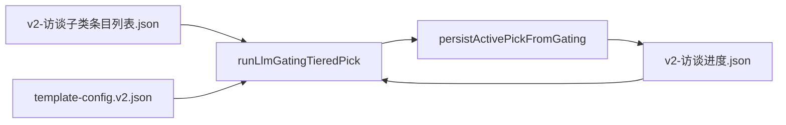

> **实现说明（已重写）**：本功能已收敛为单个模块 [`backend/src/topic/`](../backend/src/topic)，
> 只做「从配置模板加载话题 → 复用老提示词 → 调 LLM 推荐话题」。
> **不复用**老项目代码（老项目有问题），仅复用需求与提示词。下方旧的分阶段移植清单已作废，仅留存参考。

---

# Tier1 AI 选题（LLM 部分）— 分步任务清单

> **当前工程状态**：`backend/src` 仅保留认证；Tier1 相关代码已全部移除。  
> **本阶段目标**：后端能对一个已有 `materialDir` 执行 Tier1 LLM 选题并写入 `v2-访谈进度.json` 的 `activePick`；**不实现** HTTP、测试脚本、前端。  
> **参考实现**：`E:\hello story\backend` 中 `runLlmGatingTieredPick` → `tier1.handler` → `persistActivePickFromGating` 链路。  
> **环境变量**：`OPENAI_API_KEY`、`OPENAI_BASE_URL`、`OPENAI_MODEL` 三项**严格必填**（缺则 `MISSING_ENV:*`，不用 hello story 的默认 fallback）。

---

## 阶段总览（勾选进度）

- [x] **阶段 A**：配置与静态资源
- [x] **阶段 B**：素材磁盘约定（最小集）
- [x] **阶段 C**：OpenAI 兼容客户端（LLM 底座）
- [x] **阶段 D**：Catalog 与 gating 输入构建
- [x] **阶段 E**：LLM 选题核心
- [ ] **阶段 F**：Tier1 落盘与编排入口

**建议顺序**：A → B → C → D → E → F。每阶段完成后用**手写** `materialDir` 本地验证一次（不加仓库内集成测试）。

---

## 端到端数据流

**前置数据**（本清单不建 materials API，由本地或后续阶段准备）：

- `{materialDir}/输入/v2-访谈子类条目列表.json`：至少一条 `basic_profile`，`status: "ready"`
- `{materialDir}/输入/v2-访谈进度.json`：`gatingRound.nextStage === "tier1"`

---

## 阶段 A：配置与静态资源

| 序号 | 任务 | 产出 | 完成 |
|------|------|------|------|
| A1 | 在 `backend/src/config.ts` 增加严格必填：`OPENAI_API_KEY`、`OPENAI_BASE_URL`、`OPENAI_MODEL` | 启动时校验 LLM 配置 | [ ] |
| A2 | 从 hello story 复制 `prompts/interview/sub-category-gating.md` 与 `sub-category-gating-tiered.md` | 选题 prompt | [ ] |
| A3 | 复制 `frontend/public/template-config.v2.json`（路径与 `templateCatalogV2` 解析一致即可） | 子类 catalog | [ ] |
| A4 | 更新 `README.md` 的 Required env 列表 | 文档 | [ ] |

---

## 阶段 B：素材磁盘约定（最小集）

| 序号 | 任务 | 产出 | 完成 |
|------|------|------|------|
| B1 | 新增精简 `backend/src/constants/materialLayout.ts`：仅 `MATERIAL_INPUT_SUBDIR` + `materialUserInputRootAbs` | `material_dir/输入/` | [ ] |
| B2 | 新增 `backend/src/services/materialPipelineFilenames.constants.ts`：条目列表、访谈进度、ai-traces 子目录名 | 文件名常量 | [ ] |
| B3 | 新增 `backend/src/services/materialDiskJson.ts`：读写 JSON 辅助 | 磁盘 JSON | [ ] |
| B4 | 扩展 `workspace.service.ts`：`createTextWorkspace` 只建 `输入/` + 两个 JSON 骨架（可选） | 最小工作区 | [ ] |

---

## 阶段 C：OpenAI 兼容客户端（LLM 底座）

| 序号 | 任务 | 产出 | 完成 |
|------|------|------|------|
| C1 | 移植 `openaiCompat.ts`，**去掉** `billing` / `logger` 依赖 | `chatJson`、`getOpenAiCompatEnv` | [ ] |
| C2 | 新增 `promptPath.ts`：`resolveRepoPromptPath` → `prompts/` | 加载 prompt | [ ] |
| C3 | 新增 `interviewAiTrace.service.ts`：包装 `chatJson`，落盘 ai-traces | LLM 可追溯 | [ ] |

**阶段验收**：`npm run build`（backend）通过；能读到三项 `OPENAI_*` env。

---

## 阶段 D：Catalog 与 gating 输入构建

| 序号 | 任务 | 产出 | 完成 |
|------|------|------|------|
| D1 | 移植 `templateCatalogV2.service.ts` | catalog 解析 | [ ] |
| D2 | 移植 `interviewGatingProfile.service.ts` | 档案硬规则 | [ ] |
| D3 | 移植 `interviewTemplateBaseLabels.service.ts` | 字段展示名 | [ ] |
| D4 | 移植 `interviewAnsweredSections.service.ts` | LLM `sections[]` | [ ] |
| D5 | 移植 `interviewGatingCandidatesV2.service.ts` | `remainingGatingCandidatesV2` | [ ] |
| D6 | 移植 `interviewGating.service.ts` 的 gating 子集（按 import 裁剪，勿整文件复制无关逻辑） | 进度 + prompt 输入 | [ ] |
| D7 | 移植 `interviewProgressBlocks.types.ts` + `interviewProgressBlocks.service.ts` | `gatingRound`、`activePick` | [ ] |
| D8 | 移植最小类型：`interviewOrchestration.types.ts`、`interviewQaEngine.types.ts`（仅选题相关） | 类型 | [ ] |

---

## 阶段 E：LLM 选题核心

| 序号 | 任务 | 产出 | 完成 |
|------|------|------|------|
| E1 | 移植 `interviewGatingTieredPick.service.ts`：`runLlmGatingTieredPick`、`assertTieredGatingShape` 等 | Tier1 调模型 | [ ] |
| E2 | 确认 prompt：base + tiered addon，`pickMode: "tiered"`，`forcedGatingStage: 1` | 与 hello story 一致 | [ ] |
| E3 | 错误码：`GATING_LLM_FAILED`、`GATING_INVALID`、`GATING_STAGE_EMPTY` | 后续 API 可映射 | [ ] |

**阶段里程碑**：对临时 `materialDir` 可调用 `runLlmGatingTieredPick({ forcedGatingStage: 1, ... })` 并得到合法 `TieredPickLlmOutput`。

---

## 阶段 F：Tier1 落盘与编排入口

| 序号 | 任务 | 产出 | 完成 |
|------|------|------|------|
| F1 | 移植 `interviewGatingTemplate.service.ts` | LLM 无法映射时的模板兜底 | [ ] |
| F2 | 移植 `tiers/interviewTierPersist.service.ts` | 写 `activePick` + gating 历史 | [ ] |
| F3 | 移植 `tiers/interviewTier.types.ts` + `tiers/tier1.handler.ts` | Tier1 `generate()` | [ ] |
| F4 | 移植 **仅 tier1** 的 `tiers/interviewTierRegistry.ts` | 不引入 tier2~8 | [ ] |
| F5 | 移植 `interviewGatingRound.service.ts` | 读/推进 `gatingRound` | [ ] |
| F6 | 移植 `interviewGatingPickOne.service.ts`（Tier1 路径）；`interviewPreprocessTierSupport` 用最小 stub | `pickInterviewSubCategory` | [ ] |
| F7 | 移植精简 `interviewSelector.service.ts`（仅 pick 分支） | 统一选题入口 | [ ] |
| F8 | 移植 `interviewUserProfile.util.ts` | `buildUserProfileFromRows` | [ ] |

**阶段里程碑**：`pickInterviewSubCategory({ materialDir, userProfile })` 后，`v2-访谈进度.json` 含 `qa.activePick`，`gatingRound` 可推进。

---

## 明确不在本清单（后续阶段）

- `materials` 表、`/api/materials`、`/api/interview/*` 路由
- `interview.routes.ts`、`advance` / `message-reply` 全量消息机
- tier2~8、热点题、预处理、成片等
- 集成测试脚本、smoke body、前端选题 UI
- `backend/data` 历史测试素材清理

---

## 与 hello story 的主要裁剪点

| 项 | 做法 |
|----|------|
| openaiCompat | 无 billing、无全局 logger |
| materialLayout | 仅 `输入/`，不含视频/发布/校验等目录 |
| interviewTierRegistry | 只注册 tier1 |
| interviewPreprocessTierSupport | stub，`isMaterialAnalysisTier` 恒 false 等 |
| OPENAI env | 三项严格必填，启动即失败 |

---

## 关键源文件索引（hello story）

| 模块 | 路径 |
|------|------|
| LLM 分层选题 | `backend/src/services/interviewGatingTieredPick.service.ts` |
| OpenAI 客户端 | `backend/src/services/openaiCompat.ts` |
| Tier1 处理器 | `backend/src/services/tiers/tier1.handler.ts` |
| 选题入口 | `backend/src/services/interviewGatingPickOne.service.ts` |
| Prompt | `prompts/interview/sub-category-gating*.md` |
| Catalog | `frontend/public/template-config.v2.json` |

---

## 下一步

默认从 **阶段 A** 开始；若已有手写 `materialDir`，也可 **B → C** 并行准备目录与 LLM 客户端。
