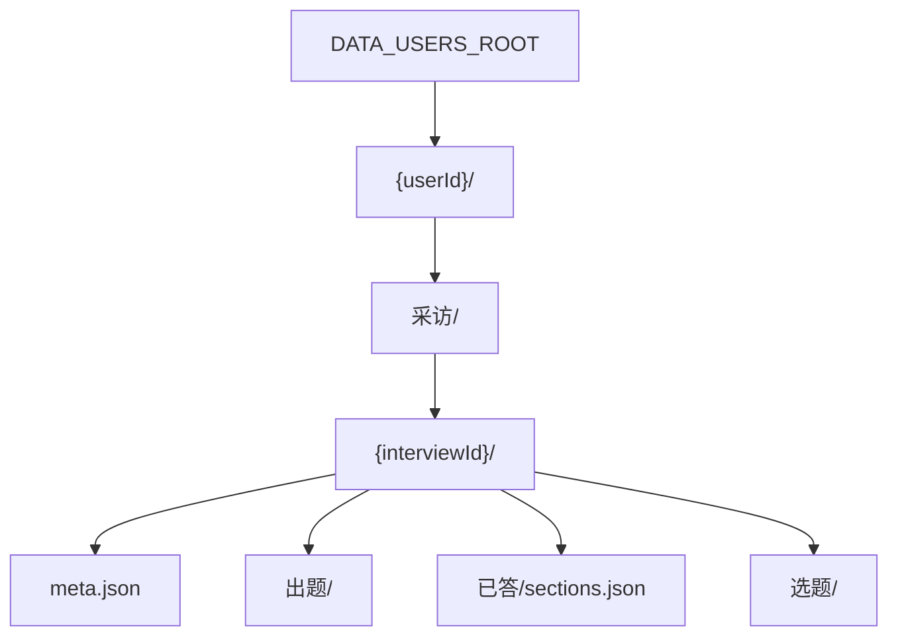

# 访谈持久化：数据层级与文件清单

本文档描述 **hello story2** 访谈/选题/出题相关数据的**磁盘层级**、**每个 JSON 文件的职责**、**读写模块**与**生命周期**（何时创建、更新、删除）。

- 物理根目录由环境变量 `DATA_USERS_ROOT` 决定（见 [`backend/src/config.ts`](../backend/src/config.ts)），典型为 `backend/data/users/`。
- 服务层通过 `InterviewScope = { userId, interviewId }` 定位一场采访；路径解析见 [`interviewWorkspace.service.ts`](../backend/src/services/interviewWorkspace.service.ts)。

编排与 HTTP 行为见 [`question-generation-module.md`](question-generation-module.md)；选题接口见 [`topic-selection-module.md`](topic-selection-module.md)。

---

## 1. 层级总览

```text
{DATA_USERS_ROOT}/
└── {userId}/                              ← 用户级（userId）
    ├── 所有文本信息文件夹/                 ← 仅占位目录，访谈模块当前不写文件
    └── 采访/                              ← 多场采访容器（createUserWorkspace 幂等创建）
        └── {interviewId}/                 ← 单场采访根（getInterviewRootDir(scope)）
            ├── meta.json                  ← 采访元数据
            ├── 出题/                      ← 进行中主题的工作区（同时最多 1 个主题）
            ├── 已答/
            │   └── sections.json          ← 已 commit 的全局小节
            └── 选题/                      ← 选题阶段 + 各档待选缓存
```



| 层级 | 作用域键 | 路径函数 | 说明 |
|------|----------|----------|------|
| 用户 | `userId` | `getUserRootDir(userId)` | 登录用户的工作区根；注册/首次访问时 `createUserWorkspace` |
| 采访 | `InterviewScope` | `getInterviewRootDir(scope)` | 一场独立访谈；出题、已答、选题互不串场 |
| 用户级子目录 | `userId` | — | `所有文本信息文件夹/`、`采访/`（空容器亦可存在） |

**已废弃（勿再使用）**：用户根下直接的 `出题/`、`已答/`、`选题/`（多采访改造前布局）。**无自动迁移**；开发环境请手动删除或自写一次性脚本。

**不在此树内的持久化**：

- SQLite 等 DB（用户账号、`data_dir` 指向用户根等）——见 `backend/src/db/`、`auth.service.ts`。
- 集成测试 trace：`backend/data/trace/{runId}/`（拷贝快照，非运行时状态）。
- 出题 LLM 管道（`questionGeneration.service`）**无状态**，不落盘。

---

## 2. 用户级

| 路径（相对 `{userId}/`） | 何时创建 | 写入模块 | 说明 |
|--------------------------|----------|----------|------|
| （目录本身） | `createUserWorkspace` | [`workspace.service.ts`](../backend/src/services/workspace.service.ts) | `fs.mkdirSync` 用户根 |
| `所有文本信息文件夹/` | 同上 | `workspace.service.ts` | 空目录占位，供后续「用户级文本资产」扩展；**当前访谈/选题/出题代码不读写其中文件** |
| `采访/` | 同上 | `workspace.service.ts`、`ensureInterviewsDir` | 采访实例的父目录；创建用户或 `createInterview` 前确保存在 |

---

## 3. 采访级：`meta.json`

| 文件 | 类型 | 何时写入 | 读写模块 |
|------|------|----------|----------|
| `meta.json` | `InterviewMeta` | `POST /api/interviews` → `createInterview` | [`interviewWorkspace.service.ts`](../backend/src/services/interviewWorkspace.service.ts) |

```ts
// InterviewMeta
{
  id: string;           // 与目录名 {interviewId} 一致（UUID）
  createdAt: string;    // ISO 8601
  updatedAt: string;    // ISO 8601（创建时与 createdAt 相同；后续可扩展更新）
  title?: string;       // 可选，创建采访时传入
}
```

- `listInterviews(userId)`：扫描 `采访/` 下子目录，读取各目录 `meta.json`，按 `createdAt` 降序。
- `assertInterviewExists(scope)`：目录存在且 `meta.json` 可读，否则 HTTP `INTERVIEW_NOT_FOUND`（404）。

**本场采访下其余目录**（`出题/`、`已答/`、`选题/`）均在首次写入对应 JSON 时按需 `mkdir`，不由 `createInterview` 预建。

---

## 4. 已答：`已答/sections.json`

| 文件 | 类型 | 读写模块 |
|------|------|----------|
| `sections.json` | `AnsweredSection[]` | [`answeredSections.service.ts`](../backend/src/services/answeredSections.service.ts) |

```ts
// AnsweredSection（数组元素）
{
  name: string;   // 节名 = 子类/主题名，全局唯一（同一场内）
  qa: Array<{ q: string; a: string }>;  // 按答题顺序
}
```

| 操作 | 触发 |
|------|------|
| 读取 | `getSections(scope)`；选题 `getPendingTopics(scope, sections)` 通常传入其返回值；出题 `sectionsForPrompt` 会合并**进行中** `出题/answers.json` |
| 写入/覆盖节 | `commitSection(scope, section)`：同名 `name` 覆盖，否则追加 |
| 测试种子 | `seedCommittedSections(scope, sections)` |

**commit 时机**（调度层）：用户在本主题答完最后一题后，`interviewOrchestrator` → `commitTopic` → 由 `questionEngine` 从 `answers.json` 组装 `AnsweredSection` 再 `commitSection`，并 **`clearTopicDir` 删除整个 `出题/`**。

**冷启动判定**：该场 `sections.json` 为空（或不存在）且不存在进行中 `出题/questionSet.json` 时，`getCurrentQuestion` 自动进入「基本档案」。

---

## 5. 选题：`选题/`

目录：`{interviewRoot}/选题/`  
模块：[`topicSelection.service.ts`](../backend/src/services/topicSelection.service.ts)、[`tierPending.ts`](../backend/src/topic/tierPending.ts)

| 文件 | 类型 | 何时写入 | 何时删除/失效 |
|------|------|----------|----------------|
| `current-stage.json` | `CurrentStage` | 首次 `readCurrentStage` / `writeCurrentStage` / `advanceStage` | 持久保留；tier 在 1～8 间递进 |
| `pending.json` | `PendingSelection` | 该档**首次** `getPendingTopics` 且磁盘无有效缓存时，LLM 选题后 `writePending` | **升档**时 `advanceStage` 删除；`pending.tier` 须与 `current-stage.json` 一致 |

```ts
// CurrentStage
{ tier: 1|2|…|8; updatedAt: string }

// PendingSelection（以 tier3 为例）
{
  tier: 3;
  createdAt: string;
  picks: PendingPickRow[];
}

// PendingPickRow
{
  pick: TopicPick;              // 接口1 列表项（title / reason / kind / tier）
  questions?: string[];         // 预填接口2 题面（Tier3 生成问句、Tier5 摘录等）
  suggestedAnswers?: string[];  // 如 Tier4 热点快捷回复
}
```

**接口1 缓存语义**（重要）：

- 产品路径：**用户逐档完成** tier（见 [`topic-selection-module.md` §2.1](topic-selection-module.md#21-产品路径审查约定)）；升档后上一档 pending 已删，下一档用最新 `sections` 重新选题。
- 当前档 `pending.json` 只在本轮该档有效；**同档再次 `getPendingTopics` 若文件已存在（含 `picks: []`）则不会重调 LLM**，传入的 `sections` 会被忽略——在逐档路径下这是预期，**不是**与 `sections` 不同步的缺陷。
- `picks: []` 表示「本档本轮无候选」；调用方应 `advanceStage`，勿指望换 `sections` 重试。
- `getTopicQuestions(scope, title)` **只读**当前档 pending，**不**另存 `QuestionSet` 到磁盘。

阶段循环：`1 → 2 → … → 8 → 1`；升档删上一档 pending，tier8 回到 tier1 时兜底清空，开始新一轮各档选题。

---

## 6. 出题：`出题/`（单主题工作区）

目录：`{interviewRoot}/出题/`  
模块：[`topicPersist.ts`](../backend/src/question/topicPersist.ts)、[`questionEngine.service.ts`](../backend/src/services/questionEngine.service.ts)

**不变量**：同一时刻目录内只承载**一个**进行中主题；当前主题名 = `questionSet.json` 的 `title`。本节 commit 后 **`clearTopicDir` 整目录删除**（非只删 JSON）。

| 文件 | 类型 | 何时出现 | 何时清空 |
|------|------|----------|----------|
| `questionSet.json` | `QuestionSet` | `initQuestion` / `enterTopic` → `resetTopicDir` | `clearTopicDir`（commit 或空主题跳过） |
| `answers.json` | `TopicAnswerRecord[]` | 同上，初始 `[]` | 随目录删除 |
| `prep.json` | `TemplatePrepResult`（别名 `PrepPersisted`） | catalog 子类**首次** `getNextQuestion` 懒执行 `runTemplatePrep` | 随目录删除 |
| `extend.json` | `{ questions: ExtendQuestionItem[] }` | 模板题答完后一次性 `extendSubCategory` | 随目录删除 |

```ts
// TopicAnswerRecord（answers.json 元素）
{ key: string; questionText: string; answer: string }
// catalog 模板题：key = 模板 field key（与 questionSet.questions 项一致）；questionText = 用户当时看到的口语问句
// 扩展题：key 以 __extend_ 开头

// TemplatePrepResult（prep.json）— 摘要字段
{
  skipped: boolean;
  askQuestions: string[];
  skippedQuestions: string[];
  questionTexts: Record<string, string>;
  answerSuggestions: Record<string, string[]>;
}

// ExtendPersisted
{ questions: Array<{ q: string; suggestedAnswers: string[] }> }
```

| kind | prep.json | extend.json |
|------|-----------|-------------|
| `catalog`（非基本档案） | 首次取题懒写入 | 模板答完后写入（可为 `questions: []`） |
| `catalog`（基本档案） | 跳过（`skipped: true`） | 跳过 |
| `generated` / `hot_topic` / `material_*` | 不生成 | 不生成 |

**进度**：无独立 `state.json`；当前题序 = `answers.json` 条数 + `prep`/`extend` 内容推导。

**空主题**：prep 去重后 `askQuestions` 为空时，调度层 `clearTopicDir` 且不 commit，避免卡死。

**Tier5～8（`material_*` 选题）**：直接消费 `getPendingTopics(scope, sections)` 传入的 `sections`（通常来自 `已答/sections.json`），经 [`sectionsInput.ts`](../backend/src/topic/sectionsInput.ts) 转为节摘要；无单独「素材」磁盘文件。

---

## 7. 模块 → 路径对照表

| 模块 | 作用域 | 持久化路径 |
|------|--------|------------|
| `workspace.service` | `userId` | `{userId}/`、`所有文本信息文件夹/`、`采访/` |
| `interviewWorkspace.service` | `userId` / `scope` | `采访/{id}/meta.json` |
| `answeredSections.service` | `scope` | `已答/sections.json` |
| `topicSelection.service` | `scope` | `选题/current-stage.json` |
| `tierPending` | `scope` | `选题/pending.json` |
| `topicPersist` | `scope` | `出题/*.json` |
| `questionGeneration.*` | — | 无（纯函数 + LLM） |
| `interviewOrchestrator` | `scope` | 编排上述读写，不自有新文件 |

---

## 8. 典型生命周期（单场采访）

```text
1. POST /api/interviews
   → 采访/{id}/meta.json

2. GET .../current（sections 空、无 出题/）
   → 自动 出题/questionSet.json（基本档案）+ answers.json[]

3. 用户逐题 submit → append answers.json
   → 基本档案答完 → commitSection → 已答/sections.json；clearTopicDir

4. 选主题阶段
   → 读/写 选题/current-stage.json、pending.json
   → enterTopic → 出题/ 再次建立

5. catalog 主题答题
   → 懒写 prep.json → 可能 extend.json → answers 增长 → commit → sections 增长

6. advanceStage 直至 tier8→1
   → 删除全部 tier*.json，stage 回到 tier1

7. 并行第二场采访
   → 另一 interviewId 下独立一套 出题/、已答/、选题/
```

---

## 9. 原子写与并发

以下路径写入均采用 **临时文件 + `rename`**（同进程内避免半写 JSON）：

- `meta.json`、`sections.json`、`选题/*`、`出题/*`（`topicPersist.writeJsonAtomic` / `answeredSections` / `topicSelection` / `interviewWorkspace`）

多进程或多实例同时写同一 `scope` **未做文件锁**；生产若多副本部署需外部分片或锁策略（本期未实现）。

---

## 10. 相关环境变量与 API

| 项 | 说明 |
|----|------|
| `DATA_USERS_ROOT` | 用户数据根，默认配置见 `.env` |
| `POST /api/interviews` | 创建采访 + `meta.json` |
| `GET /api/interviews` | 列出 `meta.json` 索引 |
| `GET/POST /api/interviews/:id/current|submit` | 读写上述采访级状态（需登录） |
