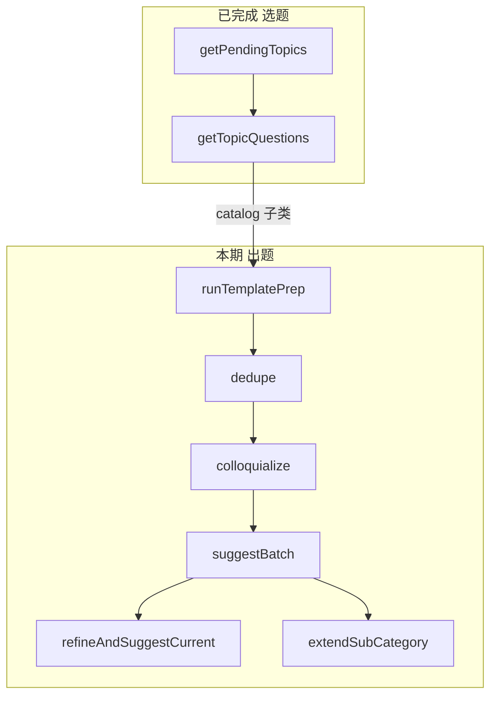

# 出题模块规划文档

> **状态**：规划已定稿，**按下方「逐步实现清单」逐个 LLM 落地**。  
> 首期范围：**catalog 子类模板题**的 LLM 管道 + 最小 service，**不做** HTTP / 完整 QuestionEngine。  
> 相关模块：[`topic-selection-module.md`](topic-selection-module.md)（选题，已完成）。

---

## 1. 模块定位

| 模块 | 职责 | 代码（当前/计划） |
|------|------|-------------------|
| **选题器** | tier1～8 推荐话题；用户确认后给出题面骨架 | [`topicSelection.service.ts`](../backend/src/services/topicSelection.service.ts)、[`backend/src/topic/`](../backend/src/topic/) |
| **出题器（本期）** | 用户进入某个子类填表时：去重、口语化、批量/逐题备选、逐题 refine、段末扩展追问 | [`backend/src/question/`](../backend/src/question/)（**只消费** 接口 2 的 `QuestionSet`）、[`questionGeneration.service.ts`](../backend/src/services/questionGeneration.service.ts) |

老项目把两者合在 `QuestionEngine` + MessageAgent；本项目**拆分**，选题已独立，出题只处理「子类内模板问答体验」。

---

## 2. 老项目能力清单（参考 `E:\hello story`）

产品步骤见老项目 [`logic/AI问答逻辑设计.md`](../../hello%20story/logic/AI问答逻辑设计.md) §3～8；实现以 `interviewQuestionEngine.service.ts`（出题器）+ `interviewTemplateOptimizePipeline.service.ts`（批量三步）为准。

### 2.1 本期要做的模板出题（catalog）

| 序号 | 功能 | 触发时机 | 老项目 service | 提示词（老路径） | hello story2 计划 |
|------|------|----------|----------------|------------------|-------------------|
| Q1 | **模板去重** | 选定子类、开答前 | `interviewTemplateDedupe.service.ts` | `prompts/interview/dedupe-template-questions.md` | `question/dedupe.ts` |
| Q2 | **批量口语化** | 去重后 | `interviewTemplateColloquialize.service.ts` | `colloquialize-template-questions.md` | `question/colloquialize.ts` |
| Q3 | **批量推测备选** | 口语化后 | `interviewTemplateSuggestAnswers.service.ts` | `suggest-template-answers.md` | `question/suggestBatch.ts` |
| Q3b | **备选常识过滤** | 批量备选后 | `interviewTemplateSuggestAnswersFilter.ts` | （规则，无 prompt） | **后期**（本期不做） |
| Q4 | **逐题优化（refine）** | 同子类从**第 2 道模板题**起，每题一次 | `interviewQuestionRefine.service.ts` | `refine-current-question.md` | `question/refineCurrent.ts` |
| Q5 | **逐题推测备选** | 与 Q4 同轮 | `interviewCurrentAnswerSuggest.service.ts` | `suggest-current-answer-options.md` | `question/suggestCurrent.ts` |
| Q6 | **子类扩展追问** | 该子类模板必填答完后 | `interviewExtend.service.ts` | `extend-sub-category-questions.md` | `question/extend.ts` |

**批量编排（一期末尾）**：`runTemplatePrep` = Q1 → Q2 → Q3（+ Q3b），对应老 `LlmTemplateOptimizePipeline.run`。

**逐题展示合并规则（与老项目一致）**：UI 备选 = 批量 `answerSuggestions[fieldKey]` ∪ 逐题 `suggestCurrent`，去重后 **最多 4 条**；逐题 refine 的 `questionText` 覆盖批量口语化文案（从第 2 题起）。

### 2.2 文档有、老代码未落地的项

| 功能 | 说明 |
|------|------|
| **引导问（bridge）** | 开答前 0～2 题；老仓库无 `sub-category-bridge-questions.md`、无 service。**本期不做**，类型可预留。 |

### 2.3 不属于本期「出题管道」（选题或其它模块已覆盖）

| 能力 | 老项目 | hello story2 |
|------|--------|----------------|
| Tier1～8 选题 | gating / selector | [`topicSelection.service.ts`](../backend/src/services/topicSelection.service.ts) |
| Tier3 确认后生成 1～3 问 | `tier3-question-generate.md` | Tier3 选题写入 `pending.questions` |
| Tier4 热点问句 | `hot-topic-questions.md` | Tier4 选题 + `getTopicQuestions` |
| Tier5～8 预处理题 | preprocess JSON | 选题 LLM + 接口2 题面 |
| catalog 接口2 仅 field key | — | `getTopicQuestions`（`kind: catalog`）→ 待出题管道替换为口语化问句 |
| 创建视频前预处理对话 | `interviewPreprocessMessageHandler` | **未规划在本模块** |
| HTTP `next-message` / `message-reply` | MessageAgent | **二期/三期** |

---

## 3. 业务流程（首期）

用户通过选题器确认 **catalog 子类**（如「小学」）后，访谈填表侧调用出题管道：

```
[选题] getTopicQuestions → 已知子类名 + 模板 fieldKeys（过渡）
[出题] runTemplatePrep(subCategoryName, sections)     // 开答前一次
  → 按 fieldKey 顺序逐题展示
  → 第 1 题：批量口语化 questionText + 批量备选
  → 第 2 题起：refineAndSuggestCurrent(...)           // 每题 LLM
  → 模板必填答完：extendSubCategory(...)              // 0～3 条开放追问（老项目引擎侧硬 cap 2 条 aiExtended，二期落盘）
```



---

## 4. 与选题模块的边界

- **选题**输出：`TopicPick` + 接口 2 的 `QuestionSet`。
- **出题**输入：`sections` + **`QuestionSet`**（同一结构；草稿已答须合并进 `sections`）。
- **出题**输出（逐步实现）：如步骤 1 的 `askQuestions` / `skippedQuestions`；后续口语化/备选等再定。

---

## 5. 跳过规则

| 子类 | 批量三步 Q1～Q3 | refine Q4～Q5 | extend Q6 |
|------|-----------------|---------------|-----------|
| `basic_profile`（基本档案） | **跳过** | **跳过**（用模板 label） | **跳过** |
| `gen_*` / 素材分析子类 | **跳过**（选题已给题） | **跳过** | **跳过** |
| 普通 catalog（小学、中学…） | **执行** | **执行** | **执行** |

---

## 6. 计划目录与依赖

### 6.1 目录

**步骤 0 已落地**（见 §11）：

```
backend/src/question/
  types.ts          # ✅ 步骤 0
  loadPrompt.ts     # ✅ 步骤 0
  index.ts          # ✅ 步骤 0
  parseDedupe.ts
  parseColloquialize.ts
  parseSuggestBatch.ts
  parseRefine.ts
  parseSuggestCurrent.ts
  parseExtend.ts
  dedupe.ts
  colloquialize.ts
  suggestBatch.ts
  refineCurrent.ts
  suggestCurrent.ts
  extend.ts
  runTemplatePrep.ts
  index.ts

backend/src/services/questionGeneration.service.ts   # 对外薄封装

prompts/interview/                                    # 每期新增 1 个精简 prompt
  dedupe-template-questions.md                        # 待从老项目精简复制
  colloquialize-template-questions.md
  suggest-template-answers.md
  refine-current-question.md
  suggest-current-answer-options.md
  extend-sub-category-questions.md

backend/test/integration/question/                    # 每步一个 integration 脚本
```

### 6.2 复用（禁止整文件移植老 service）

| 依赖 | 路径 |
|------|------|
| LLM 调用 | [`backend/src/topic/llm.ts`](../backend/src/topic/llm.ts) `chatJson` |
| 题面输入 | 选题器接口 2 的 [`QuestionSet`](../backend/src/topic/types.ts)（`getTopicQuestions`）；出题模块不读 JSON |
| 已答节 | [`AnsweredSection`](../backend/src/topic/types.ts)、[`sectionsInput.ts`](../backend/src/topic/sectionsInput.ts) |
| 测试 fixtures | [`backend/test/fixtures/sections.stub.ts`](../backend/test/fixtures/sections.stub.ts)、`sections.luxun.ts` |

提示词：从 `E:\hello story\prompts\interview\` **抄起点再精简**（删 gating/tier/bridge 等分支），见 [.cursor/rules/legacy-project-reference-only.mdc](../.cursor/rules/legacy-project-reference-only.mdc)。

---

## 7. 出题统一词汇

出题阶段**只认** [`QuestionSet`](../backend/src/topic/types.ts)（接口 2 输出）：

- `title`：本轮主题
- `questions: string[]`：待处理题列表（不区分来源；catalog 时与选题文档中的配置 key 一致，但出题代码不单独命名）
- `suggestedAnswers?`：可选

编排层用 `kind` 决定是否调用某步 LLM（如去重仅 `kind === "catalog"`）。

### 步骤 1 API

```ts
dedupeQuestions(params: {
  sections: AnsweredSection[];
  questionSet: QuestionSet;
}): Promise<DedupeQuestionsResult>;
```

`DedupeQuestionsResult`：`decisions[].question`、`skippedQuestions`、`askQuestions`

### 步骤 2 API

```ts
colloquializeQuestions(params: {
  sections: AnsweredSection[];
  questionSet: QuestionSet;
  askQuestions: string[]; // 通常为步骤 1 的 askQuestions
}): Promise<ColloquializeQuestionsResult>;
```

`ColloquializeQuestionsResult`：`questions[].question` / `questionText` / `reason`，以及 `questionTexts` 映射。

### 步骤 3 API

```ts
suggestBatchAnswers(params: {
  sections: AnsweredSection[];
  questionSet: QuestionSet;
  askQuestions: string[];
  questionTexts: Record<string, string>; // 步骤 2 产出
}): Promise<SuggestBatchQuestionsResult>;
```

`SuggestBatchQuestionsResult`：`suggestions[].question` / `suggestedAnswers`，以及 `answerSuggestions` 映射。

### 步骤 4 API

```ts
runTemplatePrep(params: {
  sections: AnsweredSection[];
  questionSet: QuestionSet;
}): Promise<TemplatePrepResult>;
```

`TemplatePrepResult`：`skipped`、`askQuestions`、`skippedQuestions`、`questionTexts`、`answerSuggestions`（扁平汇总，不含各步子结果）。`skipped: true` 时表示三步 LLM 未执行（基本档案等用模板原文）。

### 步骤 5 API

```ts
refineCurrentQuestion(params: {
  sections: AnsweredSection[];
  questionSet: QuestionSet;
  currentQuestion: string;
  batchQuestionText: string; // runTemplatePrep.questionTexts[currentQuestion]
  answeredInTopic: AnsweredInTopicItem[]; // 本主题已答，按顺序，不含当前题
}): Promise<RefineCurrentQuestionResult>;
```

`shouldRefineCurrentQuestion(answeredInTopic)` 为 false 时（第 1 题）直接返回批量 `batchQuestionText`，不调 LLM。从第 2 题起调用方应先判断为 true 再调 LLM。

### 步骤 6 API

```ts
suggestCurrentAnswers(params: {
  sections: AnsweredSection[];
  questionSet: QuestionSet;
  currentQuestion: string;
  questionText: string; // refine 后的展示问句
  answeredInTopic: AnsweredInTopicItem[];
}): Promise<SuggestCurrentQuestionResult>;
```

`SuggestCurrentQuestionResult`：`candidates`（含 confidence / basis）与 `suggestedAnswers`（confidence ≥ 0.7 的 value）。`answeredInTopic` 为空时不调 LLM。

### 步骤 7 API

```ts
refineAndSuggestCurrent(params: {
  sections: AnsweredSection[];
  questionSet: QuestionSet;
  currentQuestion: string;
  batchQuestionText: string;
  batchSuggestedAnswers?: string[]; // prep.answerSuggestions[currentQuestion]
  answeredInTopic: AnsweredInTopicItem[];
}): Promise<RefineAndSuggestCurrentResult>;
```

`RefineAndSuggestCurrentResult`：`questionText`、`refineReason`、`suggestedAnswers`（逐题 ∪ 批量，去重，最多 4，逐题优先）。

### 步骤 8 API

```ts
extendSubCategoryQuestions(params: {
  sections: AnsweredSection[];
  questionSet: QuestionSet;
  templateAnswered: Record<string, string>;
}): Promise<ExtendSubCategoryResult>;
```

`templateAnswered` 为空抛 `EXTEND_MISSING_INPUT`。

### 步骤 9 API（服务层）

编排与路由优先 `import` from [`questionGeneration.service.ts`](../backend/src/services/questionGeneration.service.ts)，薄封装步骤 1～8 的 `runTemplatePrep`、`refineAndSuggestCurrent`、`extendSubCategoryQuestions` 等；本期无持久化。

端到端验收：`npm run test:question:flow`。

---

## 8. 逐步实现清单（按此顺序逐个 LLM）

每步建议顺序：**精简 prompt → parse 校验 → LLM 调用函数 → 集成测试 → 勾选状态**。

| 步骤 | LLM 能力 | Prompt 文件 | 实现文件 | 测试 script（计划） | 状态 |
|------|----------|-------------|----------|---------------------|------|
| 0 | 公共 `types` + `loadPrompt` | — | `question/types.ts`, `loadPrompt.ts`, `index.ts` | — | 已完成 |
| 1 | Q1 去重 | `dedupe-template-questions.md` | `dedupe.ts`, `parseDedupe.ts` | `npm run test:question:dedupe` | 已完成 |
| 2 | Q2 批量口语化 | `colloquialize-template-questions.md` | `colloquialize.ts`, `parseColloquialize.ts` | `test:question:colloquialize` | 已完成 |
| 3 | Q3 批量推测备选 | `suggest-template-answers.md` | `suggestBatch.ts`, `parseSuggestBatch.ts` | `test:question:suggest-batch` | 已完成 |
| 3b | 备选过滤（无 LLM） | — | `suggestFilter.ts`（后期） | — | 不做 |
| 4 | 批量编排 | — | `runTemplatePrep.ts` | `test:question:prep` | 已完成 |
| 5 | Q4 逐题 refine | `refine-current-question.md` | `refineCurrent.ts`, `parseRefine.ts` | `test:question:refine` | 已完成 |
| 6 | Q5 逐题备选 | `suggest-current-answer-options.md` | `suggestCurrent.ts`, `parseSuggestCurrent.ts` | `test:question:suggest-current` | 已完成 |
| 7 | Q4+Q5 合并 | — | `refineAndSuggestCurrent.ts`, `mergeSuggestedAnswers.ts` | `test:question:refine-suggest` | 已完成 |
| 8 | Q6 扩展追问 | `extend-sub-category-questions.md` | `extend.ts`, `parseExtend.ts` | `test:question:extend` | 已完成 |
| 9 | Service 封装 | — | `questionGeneration.service.ts` | 端到端 `test:question:flow` | 已完成 |

**每步验收建议**

- 无 `OPENAI_API_KEY`：至少跑 parse 单测（非法 JSON / 缺字段 → 明确错误码）。
- 有 Key：用 `sections.stub` 或 `sections.luxun`，对子类「小学」等跑通单步 LLM，打印 `questionText` / `suggestedAnswers` 抽样。

**错误码前缀（建议）**

- `DEDUPE_*` / `COLLOQUIALIZE_*` / `SUGGEST_*`（步骤 2 起）
- `QUESTION_REFINE_*` / `QUESTION_SUGGEST_CURRENT_*` / `QUESTION_EXTEND_*`

---

## 9. 后续阶段（本期不做）

| 阶段 | 内容 |
|------|------|
| 二期 | `QuestionEngine`：`resolveNextPrompt`、`entry.progress` 落盘、与选题阶段衔接 |
| 三期 | HTTP MessageAgent、`GET next-message` / `POST message-reply`、前端备选 chip UI |
| 可选 | bridge 引导问；同子类多 entry 去重（`priorSectionsInSubCategory`）；创建视频预处理对话流 |

---

## 10. 老项目索引（仅供查阅，禁止复制源码）

| 类型 | 路径 |
|------|------|
| 出题编排 | `E:\hello story\backend\src\services\interviewQuestionEngine.service.ts` |
| 批量管道 | `E:\hello story\backend\src\services\interviewTemplateOptimizePipeline.service.ts` |
| 编排文档 | `E:\hello story\docs\interview-v2\README-interview-orchestration.md` |
| 产品逻辑 | `E:\hello story\logic\AI问答逻辑设计.md` |

实现时以**本文档 §8 清单**为准逐项勾选；每完成一步请更新上表「状态」列。

---

## 11. 步骤 0 源码（`backend/src/question/`）

在 **Agent 模式**下创建以下三个文件（与 [`topic/prompt.ts`](../backend/src/topic/prompt.ts) 同风格，`## User` + `{{INPUT_JSON}}`）。

### `types.ts`（当前仅步骤 1）

见仓库 [`backend/src/question/types.ts`](../backend/src/question/types.ts)：`DedupeTemplateQuestionsParams` / `DedupeTemplateQuestionsResult` / `TemplateDedupeDecision` 等。

### `loadPrompt.ts`

```ts
import fs from "node:fs";
import path from "node:path";

const PROMPT_DIR = path.join(__dirname, "..", "..", "..", "prompts", "interview");

export const QUESTION_PROMPT_FILES = {
  dedupe: "dedupe-template-questions.md",
  colloquialize: "colloquialize-template-questions.md",
  suggestBatch: "suggest-template-answers.md",
  refine: "refine-current-question.md",
  suggestCurrent: "suggest-current-answer-options.md",
  extend: "extend-sub-category-questions.md",
} as const;

export type QuestionPromptId = keyof typeof QUESTION_PROMPT_FILES;

const cache = new Map<string, { system: string; userTemplate: string }>();

export function loadQuestionPrompt(
  filename: string,
  placeholder = "{{INPUT_JSON}}",
): { system: string; userTemplate: string } {
  const cacheKey = `${filename}\0${placeholder}`;
  const hit = cache.get(cacheKey);
  if (hit) return hit;

  const filePath = path.join(PROMPT_DIR, filename);
  if (!fs.existsSync(filePath)) {
    throw new Error(
      `PROMPT_NOT_FOUND: ${filename}（请先按本文档 §8 精简复制提示词到 prompts/interview/）`,
    );
  }

  const raw = fs.readFileSync(filePath, "utf-8").replace(/\r\n/g, "\n");
  const marker = "\n## User\n";
  const i = raw.indexOf(marker);
  if (i < 0) {
    throw new Error(`PROMPT_INVALID: ${filename} 缺少 ## User 段`);
  }
  const system = raw.slice(0, i).trim();
  const userTemplate = raw.slice(i + marker.length).trim();
  if (!userTemplate.includes(placeholder)) {
    throw new Error(`PROMPT_INVALID: ${filename} 的 User 段缺少 ${placeholder}`);
  }
  const parsed = { system, userTemplate };
  cache.set(cacheKey, parsed);
  return parsed;
}

export function loadDedupePrompt() {
  return loadQuestionPrompt(QUESTION_PROMPT_FILES.dedupe);
}
export function loadColloquializePrompt() {
  return loadQuestionPrompt(QUESTION_PROMPT_FILES.colloquialize);
}
export function loadSuggestBatchPrompt() {
  return loadQuestionPrompt(QUESTION_PROMPT_FILES.suggestBatch);
}
export function loadRefinePrompt() {
  return loadQuestionPrompt(QUESTION_PROMPT_FILES.refine);
}
export function loadSuggestCurrentPrompt() {
  return loadQuestionPrompt(QUESTION_PROMPT_FILES.suggestCurrent);
}
export function loadExtendPrompt() {
  return loadQuestionPrompt(QUESTION_PROMPT_FILES.extend);
}
```

### `index.ts`

见仓库 [`backend/src/question/index.ts`](../backend/src/question/index.ts)（随步骤增量导出）。

**说明**：`loadQuestionPrompt` 在 prompt 文件尚未复制时会抛 `PROMPT_NOT_FOUND`。
